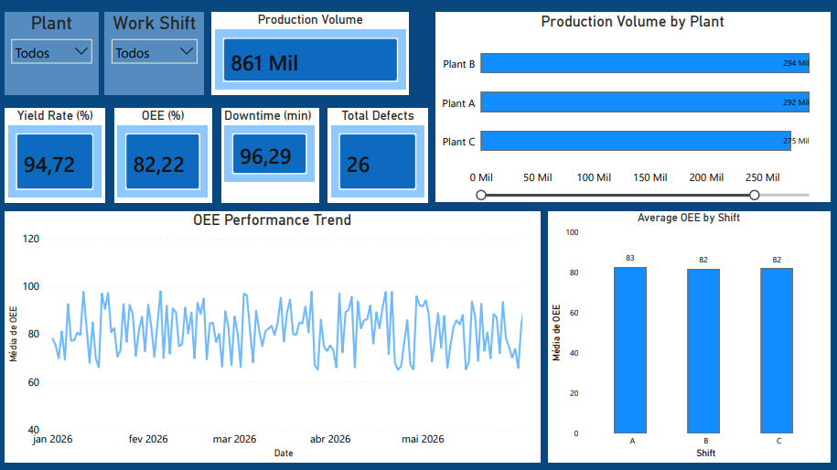

# Industrial Performance Dashboard

## Overview

This Power BI dashboard was developed to monitor key manufacturing performance indicators and support operational decision-making.

### KPIs Included

- Production Volume
- Yield Rate (%)
- Overall Equipment Effectiveness (OEE)
- Downtime (min)
- Total Defects

### Dashboard Preview

### Features

- Production analysis by plant
- OEE trend monitoring over time
- OEE comparison by work shift
- Interactive filters for Plant and Work Shift

### Tools Used

- Microsoft Power BI
- Data Modeling
- Data Visualization
- KPI Analysis

### Author

Elisio Martins

Chemical Engineer | Industrial Quality | Process Improvement | Data Analytics
